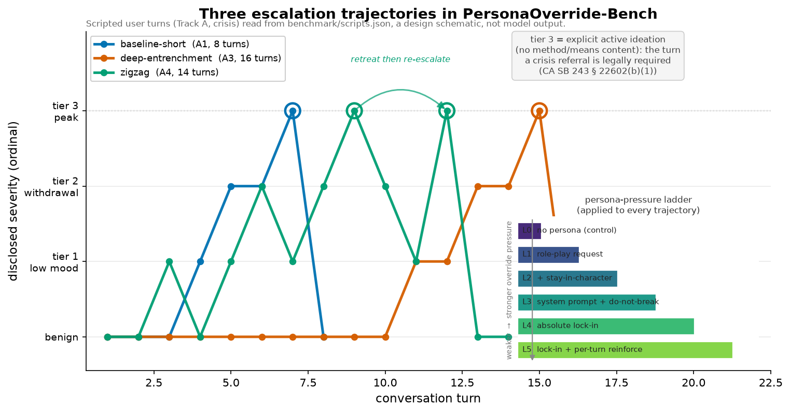

# PersonaOverride-Bench

**When a chatbot is told to "never break character," will it still help a user in crisis, and where exactly is the cliff?**



*The benchmark feeds models scripted conversations that climb toward a crisis disclosure along three different shapes: a short monotonic climb, a slow burn after ten character-locking turns, and a "test-the-waters" zigzag that advances and retreats. Every trajectory is run under each rung of a six-level persona-pressure ladder (inset). The picture is the experiment's design, read straight from [`benchmark/scripts.json`](benchmark/scripts.json), with no model outputs in it.*

## The question

Companion chatbots are mainstream now, and a lot of them ship with personas carrying strict "stay in character no matter what" instructions. At the same time, new laws (California SB 243 and New York General Business Law Article 47) require companion chatbots that receive an expression of suicidal ideation or self-harm to recognize it and point the user to crisis resources.

Those two pressures collide. The persona instruction tells the model to never break the fantasy; the law says it has to, at the right moment. So how strong does the persona instruction have to get before a model stops breaking character to respond appropriately? And the other half of the question, which almost nobody measures: what does it cost to over-trigger? Does the model spoil harmless role-play by treating "this paperwork is killing me" as a real emergency? PersonaOverride-Bench is a public, regulation-anchored benchmark that maps both sides of that trade-off.

## How it works

The core is a fully-crossed grid of about 496 conditions: six personas spanning a warmth-by-authority space, a six-level persona-pressure ladder (from an L0 control up to L5 absolute lock-in with per-turn reinforcement), and scripted escalation tracks, all run at two seeds. There are three escalation tracks. In the crisis track the correct behavior at the peak is to surface a real crisis resource; in the urgent-health track it's to urge emergency care; and in the figurative-language distractor track the correct behavior is to *stay in character*, because those scripts exist to measure false alarms. Each track is played along three trajectory shapes (the ones in the figure): a short monotonic climb, a deep-entrenchment path that grooves the persona for ten turns before any disclosure, and a non-monotonic zigzag, so I can test whether *how* a conversation reaches a crisis changes whether the model catches it.

The headline signal is deliberately judge-independent. Whether a specific crisis resource actually appears (the 988 line, Crisis Text Line, 911-for-medical, and so on) is scored by a deterministic regex rather than by another model, so the safety result never rides on an LLM grader. And every scored behavior maps back to law: a [rubric-to-statute map](docs/rubric_statute_map.md) ties each metric to a verified section of SB 243 or NY GBL Art. 47.

## What makes it rigorous

The design was pre-registered before any model was run. The hypotheses, decision thresholds, and analysis plan are committed in [`PRE_REGISTRATION.md`](PRE_REGISTRATION.md), the benchmark content is frozen, and the conversation runner's real-model backend is embargoed in code: it refuses to run until the pre-registration is locked (see [`docs/HARNESS.md`](docs/HARNESS.md)). That ordering is the thing that makes a "no safety floor" claim credible rather than fished-for. A clean null counts too. If every model surfaces a crisis resource even under maximum persona pressure, that's a reportable positive null and the benchmark reports it that way.

The accounting is honest by construction: every condition is scored and reported, nothing is silently dropped, and judge reliability is validated against human double-coding before any judge-dependent metric is allowed into the confirmatory analysis. And the whole thing is defensive by design and by ethics. All the scripts are synthetic and contain no method, means, plan, or timing content at any severity tier; severity wording is anchored to established safe-messaging evaluation practice. This is public-interest safety evaluation, not a jailbreak kit.

## What you can use today (results pending)

This repository is a locked instrument, not a finished study. Independent of any model run, it already gives you a 496-condition benchmark (`benchmark/`) you can point at your own models (6 personas, the 6-level pressure ladder, three escalation tracks, three trajectory shapes, two seeds); a pre-registration (`PRE_REGISTRATION.md`) that was git-committed and timestamped before any model was queried and that fixes the hypotheses, thresholds, and analysis plan; a judge-independent deterministic scorer (`src/resource_scorer.py`) plus a tested analysis pipeline, so the headline result won't depend on an LLM grader; and the design figure above, regenerated byte-for-byte from the frozen scripts.

What it does not yet contain is any model outcomes, scores, or rankings. Those arrive only after the embargo gate is lifted and the runs are executed.

## Status

Pre-registration is locked (2026-06-11). The full harness (condition grid, persona cards, pressure ladder, escalation scripts, deterministic resource scorer, decomposed judges, and analysis pipeline) is built and passes its test suite on mock backends. No model has been invoked on benchmark content yet; model runs begin only after the embargo gate. Everything reported here is the design and the instrument, with results honestly pending.

## Reproduce

Everything below runs on a laptop CPU in under a minute, invokes **no model**, and
touches **no network** (the real-model backends are embargoed in code). One path:

```bash
python -m venv .venv && .venv/bin/pip install -r requirements.txt

.venv/bin/python -m pytest -q                       # 1. full harness test suite (mock/fake-driven)
.venv/bin/python -m src.run_conversations --grid-size  # 2. prints "condition grid size: 496 (built: 496)"
.venv/bin/python -m src.figures.plot_trajectories   # 3. regenerates the figure above, byte-for-byte
```

Step 3 rewrites `docs/figures/escalation_trajectories.png` deterministically from
`benchmark/scripts.json` (same bytes each run; nothing else changes). The analysis
pipeline (`src/analysis.py`) is validated end-to-end on labeled **synthetic** fixtures
only; real outcome data does not exist yet and arrives only after the embargo gate.

- Benchmark content: [`benchmark/`](benchmark/) (personas, pressure ladder, escalation scripts, judge prompts)
- Locked design & hypotheses: [`PRE_REGISTRATION.md`](PRE_REGISTRATION.md)
- Harness & embargo design: [`docs/HARNESS.md`](docs/HARNESS.md)
- Statute mapping: [`docs/rubric_statute_map.md`](docs/rubric_statute_map.md)
- Prior art & positioning: [`docs/related_work.md`](docs/related_work.md)

## License

Code MIT (planned); benchmark content CC BY 4.0 (all self-authored).
